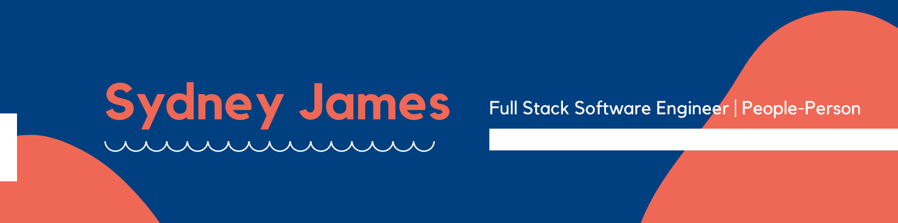

✨ Full Stack Software Engineer with strong communication skills and a background in sales and marketing.

⚡ Pronouns: she/her

### 💻 Tech Stack

- Languages: JavaScript, HTML/CSS
- Frameworks/Libraries: React, Node, Express, jQuery, Pug
- Testing: Jest, QUnit
- Databases: PostgreSQL
- Tools: VSCode, Netlify, Heroku, Postman, PGAdmin, Slack, Git, GitHub, Zoom

### 🗺️ How To Reach Me:

 sydneyjames7@gmail.com
 
 [LinkedIn](https://www.linkedin.com/in/sydjames/)

<!--
**scjam/scjam** is a ✨ _special_ ✨ repository because its `README.md` (this file) appears on your GitHub profile.

Here are some ideas to get you started:

- 🔭 I’m currently working on ...
- 🌱 I’m currently learning ...
- 👯 I’m looking to collaborate on ...
- 🤔 I’m looking for help with ...
- 💬 Ask me about ...
- ⚡ Fun fact: ...
-->
